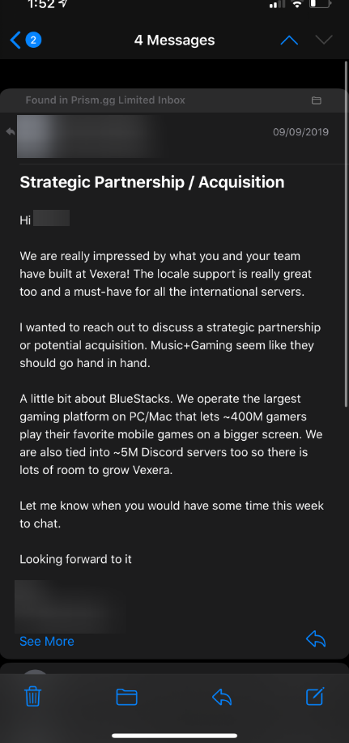
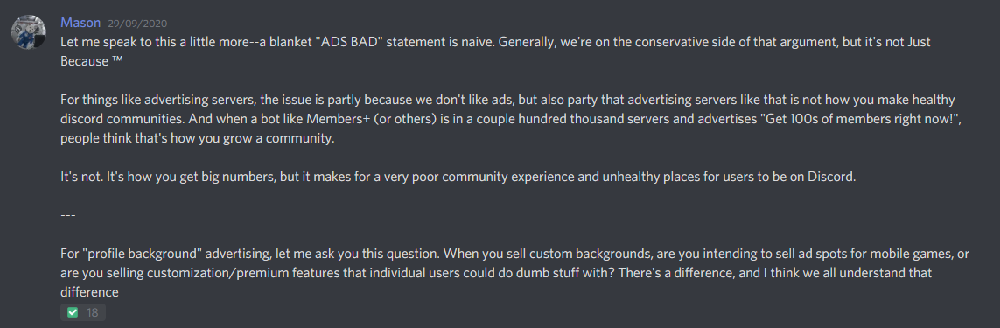
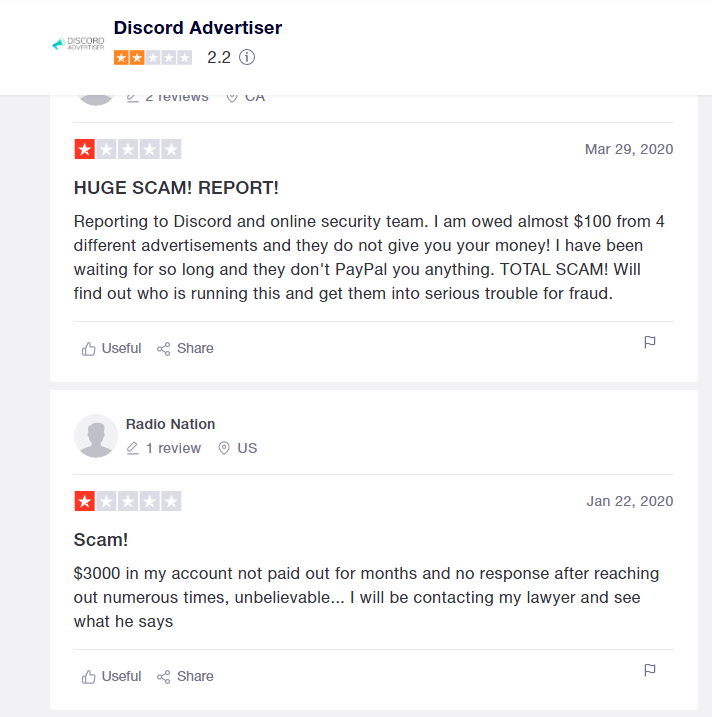

Algunos bots populares de Discord abusan de la plataforma para poner publicidad abusiva.

Quiero publicar también sobre Discord en mi blog, hablaremos sobre [BotsLabs](https://botlabs.gg), una empresa dueña [Game.tv](https://game.tv) que es parte de [Bluestacks](https://bluestacks.com), el emulador de Android para escritorio que ha estado envuelto en una polémica con respecto a los bots que han adquirido como propósito de generar ingresos mediante publicidad en Discord.

## Disclaimer
Esta publicación no está hecha con el objetivo de causar daño a nada ni nadie o decir que dejes de usar ciertos bots, solo pretendo informar y dar a conocer unos hechos, mi opinión totalmente subjetiva, irrelevante y personal la dejaré al final. En todos los apartados menciono las fuentes de información.

# Introducción
BotsLabs es una empresa que ha adquirido bots grandes de Discord, pagando los altos costes que tienen los alojamientos de estos bots, además de proporcionarles recursos económicos para cualquier cosa que necesite el bot.

Incluidos:
- [Ayana](https://ayana.io).
- [YAGPDB.xyz](https://yagpdb.xyz).
- [Carl Bot](https://carl.gg).
- [FredBoat](https://fredboat.com).

Estos bots están en total **6.781.000 servidores** y con millones de usuarios.

Un miembro del equipo de Vexera *(al cual censuro porque no he pedido permiso para mostrar su nombre)* mostró como Bluestacks ha contactado a desarrolladores de bots para adquirir sus bots desde hace tiempo.

> Hola X.
> 
> Estamos realmente impresionados por lo que usted y su equipo han construido en Vexera! El soporte regional es realmente genial también y un deber para todos los servidores internacionales. 
> 
> Quería llegar a discutir una asociación estratégica o adquisición potencial. Música+Juegos parecen debe ir de la mano.
> 
> Un poco sobre BlueStacks. Operamos el más grande plataforma de juegos en PC / Mac que permite ~400M jugadores jugar sus juegos móviles favoritos en una pantalla más grande. Nos también están vinculados a ~5M servidores Discord también, así que hay un montón de espacio para crecer Veera. Déjame saber cuándo tendrías algo de tiempo esta semana chatear.

# Publicidad en los estados de bots

El `29/09/2020` todos los bots adquiridos tenían en su estado publicidad de BlueStacks, esta promocionaba la app de Among Us en el emulador.

  

Varios usuarios informaron al staff de Discord en el servidor de Discord Developers.

Esta fue la respuesta de ellos:

> Voy a etiquetar rápidamente a @Mason en esto, ya que estará más tiempo que yo.
> Parece que todos los bots Bluestacks ahora anuncian enlaces Bluestacks en sus estados.

> Suspiro
> 
> Estos tipos realmente me están poniendo de los jodidos nervios.

Minutos después al parecer los bots empezaron a quitarla y aclararon más el tema de la publicidad en bots.

> Hemos sido bastante claros sobre la publicidad en el pasado con socios cuando se trata de bots. En general, estamos bastante bien con las funciones premium de los bots. Todo está muy bien, como "suscríbase a mee6 premium para usar este comando" o lo que sea.
>
> En segundo lugar, estamos bastante bien con las cosas asociadas / potenciadas. Como imaginar un bot de estadísticas de fortnite que en su comando de tablas de clasificación tuviera un texto de pie de página que dijera "impulsado por fortnitestats.gg" o lo que sea. No tan sencillo, pero creo que se podría tomar una decisión razonable.
>
> Anunciar algo que no proporciona un valor inherente a los usuarios de Discord o las comunidades en las que se encuentran y es estrictamente una forma de usar el alcance de un bot en nuestra plataforma para ganar dinero / usuarios objetivo no está bien️.

> Permítanme hablar de esto un poco más: una declaración general de "malos anuncios" es ingenua. Por lo general, estamos del lado conservador de ese argumento, pero no es solo porque:
>
> Para cosas como los servidores de publicidad, el problema es en parte porque no nos gustan los anuncios, pero también porque los servidores de publicidad como ese no son la forma en que se crean comunidades de Discord saludables. Y cuando un bot como Members+ (u otros) está en un par de cientos de miles de servidores y anuncia "¡Consigue cientos de miembros ahora mismo!", La gente piensa que así es como se hace crecer una comunidad.
>
> No es. Así es como obtienes grandes números, pero hace que la experiencia de la comunidad sea muy pobre y lugares poco saludables para que los usuarios estén en Discord.
>
> Para la publicidad de "fondo de perfil", permítame hacerle esta pregunta. Cuando vende fondos personalizados, ¿tiene la intención de vender espacios publicitarios para juegos móviles o está vendiendo funciones de personalización / premium con las que los usuarios individuales podrían hacer cosas tontas? Hay una diferencia, y creo que todos entendemos esa diferencia.

# Servicio de publicidad

Además, también se conoció de un servicio de BlueStacks llamado DiscordAdvertiser que está vinculado con estas empresas ya que su página principal también estuvo bajo el subdominio de Bluestacks.

* [Página principal](https://web.archive.org/web/20200614001114/https://discordadvertiser.com/building-community.html).
* [Subdominio de bluestacks.com](https://web.archive.org/web/20200614000849/http://wp-d.bluestacks.com/building-community.html).

En su publicación de [Medium](https://medium.com/@discordadvertiser/earn-money-from-your-discord-server-91f932d4bc6f) explican cómo funcionaba su servicio:

Ingresabas a su plataforma invitando a su bot que hacía publicidad y "ganas" dinero. Al parecer esto resultó totalmente falso y en una estafa según las críticas en [TrustPilot](https://www.trustpilot.com/review/discordadvertiser.com).

El dominio `discordadvertiser.com` ya no existe desde hace meses, pero aún siguen sus redes y reseñas negativas.

La página de "Building Community" en su web dice lo siguiente:
> Procesamos miles de millones de mensajes, millones de actualizaciones de estado de juegos, cientos de miles de canciones, decenas de miles de memes y más todos los días. Nuestra capacidad de llegar a nuevos jugadores para que construyas tu comunidad es incomparable.

Viniendo de un servicio de publicidad no sería raro pensar que estos datos podrían usarse con fines publicitarios, si fue ese caso (lo desconozco) estarían rompiendo los [términos de desarrolladores de Discord](https://discord.com/developers/docs/legal).
> No venderá, otorgará licencia ni comercializará de ningún otro modo datos de usuario final.

# Publicidad mientras se está reproduciendo música
Varios usuarios desde las reseñas de [bots.ondiscord.xyz](https://bots.ondiscord.xyz/bots/185476724627210241) se quejan e informan de que Ayana incluyó anuncios en los textos al reproducir canciones, además de mientras se está escuchando música sin la posibilidad de pasarlos. Esto desde que BotLabs adquirió el bot.

He intentado comprobar esto durante 10 minutos poniendo música, pero no conseguí notarlo en ningún momento, así que no he podido encontrar pruebas legítimas, si usted ha experimentado esto, por favor contacte conmigo para añadirlo.

# Respuesta de Discord

Hagamos un poco de fechas sobre todo esto.

* **18 de junio de 2020**, salió la [publicación](https://www.reddit.com/r/discordapp/comments/hbfpal/psa_some_of_discords_largest_bots_may_be_tracking/) en el Reddit informando de la publicidad mientras se reproduce música y el servicio de publicidad.

Esta fue la [respuesta](https://www.reddit.com/r/discordapp/comments/hbfpal/psa_some_of_discords_largest_bots_may_be_tracking/fv9i5er?utm_source=share&utm_medium=web2x&context=3) de un staff de Discord en los comentarios:

<a class="embedly-card" href="https://www.reddit.com/r/discordapp/comments/hbfpal/psa_some_of_discords_largest_bots_may_be_tracking/fv9i5er">Card</a>

> Hola a todos. Mi nombre es Mason. Trabajo en Discord, y probablemente me hayas visto en varios servidores de desarrollo (¡incluido el nuestro!) Si estás involucrado en la comunidad de desarrollo de bots. Quería decir que estamos analizando detenidamente estas afirmaciones. Si bien la mayoría de ustedes aquí tiene la perspectiva correcta, nos tomamos estos comentarios en serio. Tenemos una línea de comunicación directa con las personas en BlueStacks y hemos estado en contacto con ellos desde el lunes para comprender y resolver esta situación, así como para informarles de la necesidad inmediata de ser transparentes sobre la propiedad de estos bots en sus diversos sitios web. Como recordatorio, el acceso de bot a cosas como la información de presencia (los juegos que juega, sus estados personalizados, su estado en línea / ausente / ocupado) requiere la aprobación y revisión manual de Discord comenzando con la introducción de nuestro programa de verificación de bots, de los cuales todos estos bots han completado o aplicado.

* **1 de julio de 2020**, se actualizan los términos de servicio y política de privacidad para desarrolladores, esta nueva política de privacidad limita los datos sensibles a los que pueden acceder los bots, además es más estricta y clara.

* **29 de septiembre de 2020**, ocurre la publicidad en los estados de los bots.

Discord contactó con esta empresa para pedirles que sean más trasparentes, después de eso los bots y le empresa actualizaron muchos de los documentos de sus políticas de privacidad, etc. Y desde entonce no han habido más incidencias.

# Opinión personal

Es horrible que bots de Discord tengan enfoques en la publicidad abusiva, entiendo desde el punto de vista de los desarrolladores, en la información en la página de BotsLabs dicen que están bastante ocupados con otros trabajos y que por esas razones necesitaban de una empresa externa que les apoyara, desconozco que tipo de contratos tenían estos desarrolladores pero cómo de feos tienen que ser para poder obligarte a cambiar el estado de tu bot si les da la gana. Nunca vendería un bot de Discord de esta manera, prácticamente te estás riendo de los usuarios que confían en tu bot y servicio, la mayoría desconociendo estos hechos, por eso creo que es conveniente comentar eso en esta publicación.

La respuesta de Discord ha sido la adecuada ya que han respondido y contactado rápidamente desde que se supo de estos hechos y la explicación que dieron respecto a qué tipo de anuncios están permitidos en bots es realmente clara, está bien que monetices con una función premium o menciones servicios externos que usas en ese comando, pero no buscar poner publicidad con fines económicos que no les aporta nada a los usuarios de Discord.

Esa es toda mi conclusión.

# Fuente de la información
Enlaces a la fuente de la información que no está especificada en su apartado.
* [Servidor de Discord Developers](https://discord.gg/discord-developers).
* [Publicación de Reddit](https://www.reddit.com/r/discordapp/comments/hbfpal/psa_some_of_discords_largest_bots_may_be_tracking/).
* [Pastebin anónimo](https://pastebin.com/dj4kN448).
* [Noticia sobre game.tv](https://venturebeat.com/2019/12/12/game-tv-raises-25-million-to-bring-esports-to-discord-twitter-and-facebook/).
* [Página de BotsLabs](https://botlabs.gg).
* [Twitter de DiscordAdverts](https://twitter.com/discordadverts).
* [Reseñas en TrustPilot](https://www.trustpilot.com/review/discordadvertiser.com).
* [Publicación en Medium](https://medium.com/@discordadvertiser/earn-money-from-your-discord-server-91f932d4bc6f).

# Contacto
* [Discord: Vicente#0001](https://discord.vicente015.dev/287574458963722240).
* [Twitter](https://twitter.com/vicente015_).